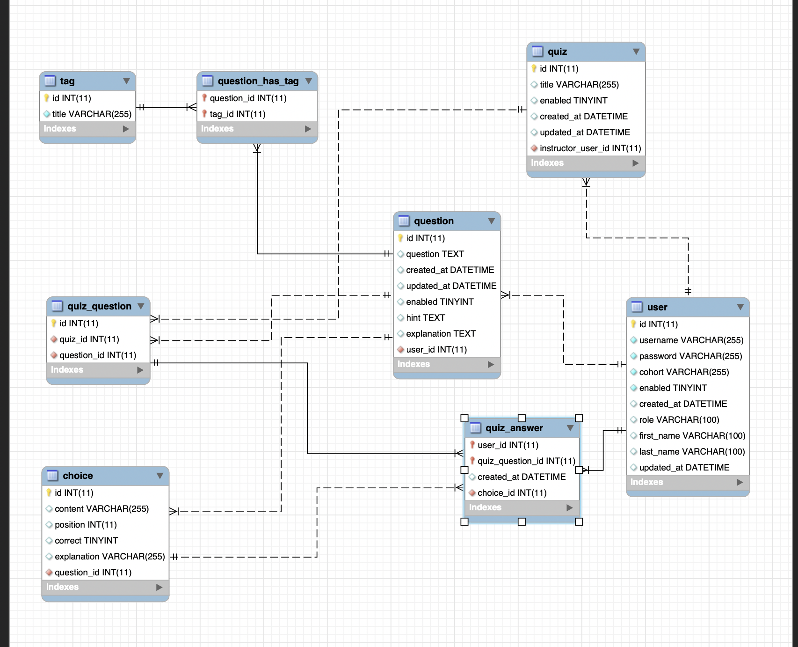
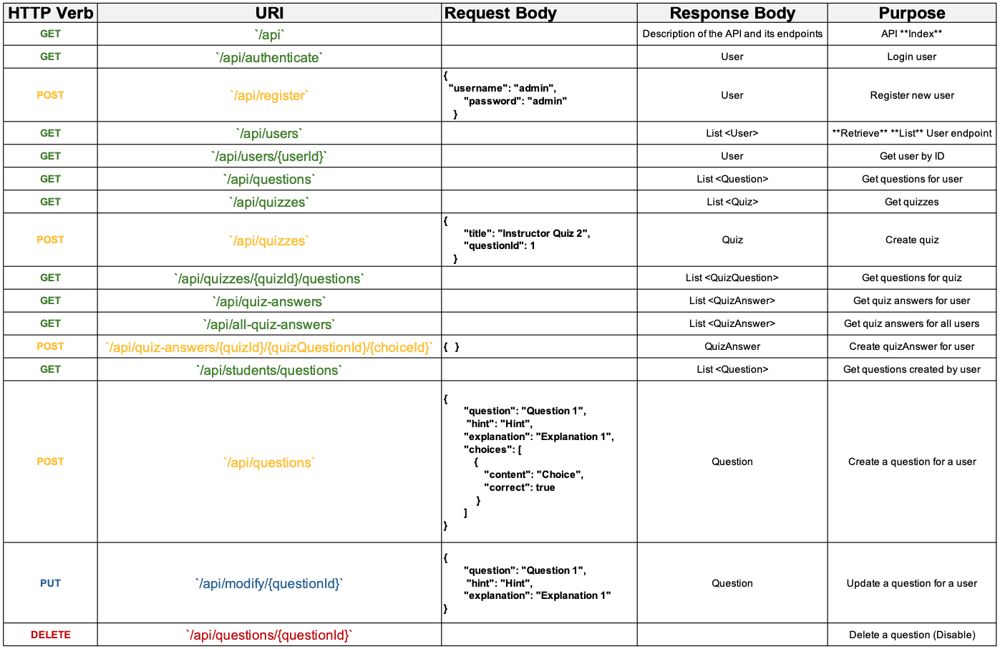

# FinalProject

# Lesson Locker

- Like the OCA Preparation quiz questions application, Lesson Locker maintains a list of quiz style questions and answers for given categories/sections of material related to coding concepts.
- Registered users (student) submit questions for approval.
- Registered users (instructor) approve questions.
- Logged in users (student) can answer quiz questions.
- Logged in users (instructor) hosts a ‘break-time’ question that is shown via zoom.
- Logged in users (student) answer the zoom question.
- Logged in users (student) answer other questions that are part of a quiz.

# Technologies Used

- Java
- Spring Boot
- JPA
- JUnit tests
- Angular
- MySql
- HTML,CSS
- Bootstrap
- Trello

# Lessons Learned

- Practice of complete REST API Development.
- Deploying Spring Boot application and Database to Tomcat10/Apache server hosted on AWS.
- Using AJAX (Async Javascript And XML) requests via Angular Service Layer.
- Design and redesign of MySQL database.
- Complete relationships, dual primary keys and related Entity mapping.

#### Features

- Full REST API with security configuration for CRUD Operations.
- MySQL Database.
- Spring Boot.
- Angular.
- HTML, CSS, Bootstrap.
- URL activatedRoute.paramMap for detail view.

## MySQL Database Schema

## API Endpoints

Skill Distillery, May 2024

Developers:

Ashley : https://github.com/ashlmasc
linkedIn : https://www.linkedin.com/in/ashleymascarenas/

Sheldon : https://github.com/pasciaks
linkedIn : https://www.linkedin.com/in/sheldonpasciak/
